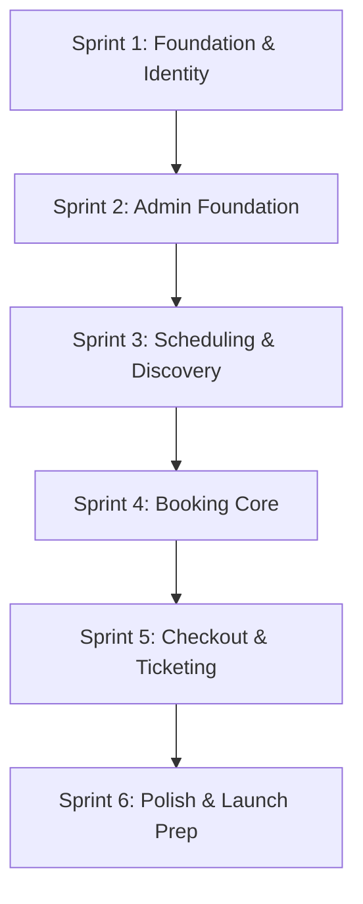

# Sprint Roadmap
## Movie Ticketing Platform (BookMyShow Clone)

| Document | Sprint Roadmap |
|---|---|
| **Version** | 1.0 |
| **Status** | Approved |
| **Author** | Senior Business Analyst |
| **Audience** | Product Manager, Scrum Master, Frontend Team, Backend Team, QA Team, DevOps |

---

## 1. Sprint Overview

This roadmap defines the implementation sequence for the Movie Ticketing Platform MVP. It is organized into 6 logical sprints, prioritizing foundational infrastructure, authentication, inventory management, and finally the core booking and payment journeys.

| Sprint | Name | Focus | Duration |
|---|---|---|---|
| **Sprint 1** | Foundation & Identity | Project scaffolding, DB schema, Authentication, User Sessions | 2 Weeks |
| **Sprint 2** | Admin Foundation | City, Movie, Theater, and Screen CRUD operations | 2 Weeks |
| **Sprint 3** | Scheduling & Discovery | Admin show scheduling, Guest/Customer movie browsing | 2 Weeks |
| **Sprint 4** | Booking Core | Theater/Show selection, Seat layout, Seat Locking mechanism | 2 Weeks |
| **Sprint 5** | Checkout & Ticketing | Payment simulation, Ticket generation, Booking History | 2 Weeks |
| **Sprint 6** | Polish & Launch Prep | Admin reports, edge-case hardening, performance testing | 1 Week |

---

## 2. Sprint Dependency Diagram

---

## 3. Detailed Sprint Plan

### Sprint 1: Foundation & Identity

**Sprint Goal:** Establish the technical foundation, deploy the database schema, and implement secure user registration, authentication, and session management.

**Business Value:** Ensures the system is secure and ready to track users. Provides the scaffolding required for all subsequent features.

**Included Modules:**
* Project Infrastructure
* Authentication

**Included Features:**
* User Registration
* User Login
* User Logout
* Session Management

**User Stories:**
* As a Guest, I want to register an account so I can book tickets.
* As a Registered User, I want to securely log in and log out of my account.

**BDD Scenarios Covered:**
* Guest Registration (Success/Failure)
* User Login (Valid/Invalid Credentials)
* Session Persistence & Expiry

**Database Tables Required:**
* `users`

**API Endpoints Required:**
* `POST /api/v1/auth/register`
* `POST /api/v1/auth/login`
* `POST /api/v1/auth/refresh`
* `POST /api/v1/auth/logout`
* `GET /api/v1/auth/me`

**Frontend Screens:**
* Web/Mobile: Landing Page (partial), Login Screen, Registration Screen.

**Backend Components:**
* Express setup, Knex migration setup, JWT utility, `authController`, `authService`, `userRepository`.

**QA Deliverables:**
* Test scripts for Auth APIs. Validation of password hashing (Bcrypt). Validation of JWT token expiry. Validation of KPI-AUTH-001 to KPI-AUTH-006.

**Acceptance Criteria:**
* User can register and password is encrypted.
* User can login and receive a JWT.
* Application correctly identifies authenticated vs. guest users.
* Database migrations run successfully.

**Risks:**
* Improper handling of JWT refresh tokens could lead to session hijacking.

**Dependencies:**
* None (Initial Sprint).

**Estimated Complexity:** Medium

---

### Sprint 2: Admin Foundation (Inventory Management)

**Sprint Goal:** Build the Admin Portal capabilities to manage the static inventory (Cities, Movies, Theaters, Screens, and Seats).

**Business Value:** Provides administrators the tools to populate the platform with the foundational data necessary for customers to discover movies.

**Included Modules:**
* City Management
* Admin - Movie Management
* Admin - Theater Management
* Admin - Screen Management

**Included Features:**
* Movie CRUD
* Theater CRUD
* Screen CRUD & Seat Auto-generation
* City Listing

**User Stories:**
* As an Admin, I want to add and edit movies so they appear on the platform.
* As an Admin, I want to manage theaters and their seating layouts.
* As a Guest/User, I want to select my city to see relevant content.

**BDD Scenarios Covered:**
* Admin adding a movie.
* Admin configuring a screen layout.
* Customer changing city context.

**Database Tables Required:**
* `cities`, `movies`, `theaters`, `screens`, `seats`

**API Endpoints Required:**
* `GET /api/v1/cities`
* `GET, POST, PUT, DELETE /api/v1/admin/movies`
* `GET, POST, PUT, DELETE /api/v1/admin/theaters`
* `GET, POST, PUT, DELETE /api/v1/admin/theaters/:theaterId/screens`

**Frontend Screens:**
* Web Admin Portal: Dashboard skeleton, Movie Management UI, Theater/Screen Management UI.
* Web/Mobile App: City Selector Modal.

**Backend Components:**
* RBAC Middleware, Admin Controllers, Admin Services, respective Repositories.

**QA Deliverables:**
* Validation of RBAC (ensuring customers cannot hit admin routes). Validation of Seat generation logic. Validation of KPI-CITY-001, KPI-ADM-001 to KPI-ADM-005.

**Acceptance Criteria:**
* Only admins can access CRUD operations.
* Creating a screen automatically generates the correct number of `seats` records.
* Users can retrieve the list of active cities.

**Risks:**
* Performance issues if rendering massive seat grids in the Admin UI without optimization.

**Dependencies:**
* Sprint 1 (Admin users must be able to log in).

**Estimated Complexity:** High

---

### Sprint 3: Scheduling & Discovery

**Sprint Goal:** Enable administrators to schedule shows mapping movies to screens, and allow customers to browse and filter these movies on the frontend.

**Business Value:** Connects the inventory to the customer. Users can now explore what's playing, reading movie details, preparing for the booking journey.

**Included Modules:**
* Admin - Show Management
* Movie Discovery

**Included Features:**
* Admin Show Scheduling
* Movie Listing & Search
* Movie Filtering
* Movie Details View

**User Stories:**
* As an Admin, I want to schedule a movie to a screen at a specific time.
* As a Guest/User, I want to search for a movie and view its details.

**BDD Scenarios Covered:**
* Admin scheduling a show (valid vs. overlapping).
* User searching for a movie by title.
* User viewing movie synopsis and cast.

**Database Tables Required:**
* `shows`, `show_seats`

**API Endpoints Required:**
* `GET, POST, PUT, DELETE /api/v1/admin/shows`
* `GET /api/v1/movies`
* `GET /api/v1/movies/:id`

**Frontend Screens:**
* Web Admin Portal: Show Scheduling Calendar/List.
* Web/Mobile App: Homepage (Now Showing list), Movie Details Screen, Search/Filter overlays.

**Backend Components:**
* Overlap validation logic in `adminShowService`, `show_seats` auto-generation, Movie search query builders (Knex).

**QA Deliverables:**
* Validation of show overlap prevention. Validation of `show_seats` creation. Search latency tests. Validation of KPI-MOV-001 to KPI-MOV-005, KPI-ADM-006, KPI-ADM-007.

**Acceptance Criteria:**
* System prevents scheduling two shows on the same screen at overlapping times.
* Scheduling a show generates `show_seats` for all active seats in the screen.
* Customers can search movies by title and filter by genre.

**Risks:**
* Search performance on large datasets without dedicated search infrastructure (e.g., ElasticSearch). We rely on indexed DB queries for MVP.

**Dependencies:**
* Sprint 2 (Requires Movies, Theaters, and Screens to exist).

**Estimated Complexity:** High

---

### Sprint 4: Booking Core (Seat Selection)

**Sprint Goal:** Implement the critical path for users to select a theater, a showtime, and interactively select seats with strict concurrency locking.

**Business Value:** The core interaction of the platform. Guarantees that users can reliably lock seats without race conditions before paying.

**Included Modules:**
* Theater & Show Browsing (Customer)
* Seat Booking

**Included Features:**
* Showtime Selection
* Interactive Seat Layout
* Seat Locking Mechanism

**User Stories:**
* As a Registered User, I want to see available showtimes for a movie.
* As a Registered User, I want to view a visual seat map and select my preferred seats.
* As a Registered User, I want my selected seats locked temporarily so I can pay without someone else taking them.

**BDD Scenarios Covered:**
* User viewing available showtimes.
* User locking available seats.
* Two users attempting to lock the same seat simultaneously (Race condition).

**Database Tables Required:**
* `bookings` (Initiated status)

**API Endpoints Required:**
* `GET /api/v1/movies/:movieId/shows`
* `GET /api/v1/shows/:showId/seats`
* `POST /api/v1/bookings` (Seat Lock endpoint)

**Frontend Screens:**
* Web/Mobile App: Theater/Date Selection Screen, Interactive Seat Selection Grid, Booking Summary Sheet.

**Backend Components:**
* Database transactions for seat locking, expiration timeout logic, `bookingService`.

**QA Deliverables:**
* Concurrency testing (JMeter/Gatling) targeting the booking API to ensure zero double-bookings. Validation of KPI-THEATER-001, KPI-SEAT-001 to KPI-SEAT-006, KPI-EDGE-001.

**Acceptance Criteria:**
* Seat map accurately reflects `available`, `locked`, and `booked` statuses.
* The system enforces a maximum booking limit of 10 seats per transaction.
* If two users click the same seat exactly at the same time, only one succeeds, the other receives an error.

**Risks:**
* High concurrency on the `show_seats` table leading to database locks or double booking if transaction boundaries are flawed.

**Dependencies:**
* Sprint 3 (Requires Shows and Show Seats to exist).

**Estimated Complexity:** High (Critical Path)

---

### Sprint 5: Checkout & Ticketing

**Sprint Goal:** Complete the transaction flow by calculating fees, simulating payment, confirming the booking, and generating the digital ticket.

**Business Value:** Realizes the revenue. Completes the primary user journey and provides the user with the final digital product.

**Included Modules:**
* Checkout
* Payment
* Ticket Generation
* Booking History

**Included Features:**
* Checkout Summary & Fee Calculation
* Simulated Payment Gateway
* Digital Ticket (QR) Generation
* My Bookings Dashboard

**User Stories:**
* As a Registered User, I want to review my total cost including convenience fees.
* As a Registered User, I want to pay for my tickets.
* As a Registered User, I want to receive a digital ticket with a QR code to enter the theater.
* As a Registered User, I want to view my past and upcoming bookings.

**BDD Scenarios Covered:**
* User completing a successful payment.
* Payment failing and releasing locked seats.
* User viewing their digital ticket.

**Database Tables Required:**
* `payments`, `tickets`

**API Endpoints Required:**
* `POST /api/v1/bookings/:id/payment`
* `GET /api/v1/bookings`
* `GET /api/v1/bookings/:id`

**Frontend Screens:**
* Web/Mobile App: Checkout Screen, Payment Simulator Modal, Digital Ticket View, My Bookings List.

**Backend Components:**
* Payment processing logic, Ticket token generation, Booking state machine updates.

**QA Deliverables:**
* Validation of total amount calculation. Validation of payment timeout releasing seats. Validation of KPI-CHK-001 to KPI-CHK-003, KPI-PAY-001 to KPI-PAY-004, KPI-TICKET-001 to KPI-TICKET-004, KPI-HIST-001 to KPI-HIST-003.

**Acceptance Criteria:**
* Convenience fee is calculated correctly.
* Successful payment updates the booking status to `confirmed` and generates a `ticket`.
* Users can view a list of their bookings and open individual digital tickets.

**Risks:**
* Edge cases where payment succeeds but network drops before client receives the success response.

**Dependencies:**
* Sprint 4 (Requires locked bookings to exist).

**Estimated Complexity:** Medium

---

### Sprint 6: Admin Reports & Polish

**Sprint Goal:** Deliver administrative reporting capabilities, perform end-to-end bug fixing, UI polish, and performance optimization prior to MVP launch.

**Business Value:** Ensures operational visibility for theater management and guarantees a smooth, performant experience for end-users.

**Included Modules:**
* Admin - Reports
* System Polish

**Included Features:**
* Admin Booking Reports
* End-to-End Edge Case Handling
* Performance Tuning

**User Stories:**
* As an Admin, I want to see aggregate booking metrics and occupancy rates.
* As a Business Owner, I want the platform to load fast and not crash during peak times.

**BDD Scenarios Covered:**
* Admin viewing reports.
* Edge cases (e.g. Session expiry during checkout).

**API Endpoints Required:**
* `GET /api/v1/admin/reports/bookings`

**Frontend Screens:**
* Web Admin Portal: Reports Dashboard.

**Backend Components:**
* Aggregation queries in Knex.js. Caching configurations if necessary.

**QA Deliverables:**
* Final UAT (User Acceptance Testing). Load testing (KPI-API-001 to KPI-API-005). Validation of KPI-ADM-008.

**Acceptance Criteria:**
* Admin can view accurate total revenue and ticket counts.
* All API endpoints meet latency SLAs (< 500ms).
* Zero critical UI bugs across Web, Mobile, and Tablet viewports.

**Risks:**
* Last-minute integration issues across Web and Mobile targets in Flutter.

**Dependencies:**
* Sprint 5 (Requires bookings to exist to generate reports).

**Estimated Complexity:** Low (Primarily Stabilization)

---

## 4. Module-to-Sprint Mapping

| Module | Sprint |
|---|---|
| Authentication | Sprint 1 |
| City Management | Sprint 2 |
| Admin Movie Management | Sprint 2 |
| Admin Theater Management | Sprint 2 |
| Admin Screen Management | Sprint 2 |
| Admin Show Management | Sprint 3 |
| Movie Discovery | Sprint 3 |
| Theater & Show Browsing | Sprint 4 |
| Seat Booking | Sprint 4 |
| Checkout | Sprint 5 |
| Payment | Sprint 5 |
| Ticket Generation | Sprint 5 |
| Booking History | Sprint 5 |
| Admin Reports | Sprint 6 |

---

## 5. Feature-to-Sprint Mapping

*(Refer to PRD and Feature Catalogue for full details)*

| Feature ID | Feature Name | Sprint |
|---|---|---|
| F-001 | User Registration | Sprint 1 |
| F-002 | User Login | Sprint 1 |
| F-003 | Select City | Sprint 2 |
| F-004 | Browse Movies | Sprint 3 |
| F-005 | Search Movies | Sprint 3 |
| F-006 | Filter Movies | Sprint 3 |
| F-007 | View Movie Details | Sprint 3 |
| F-008 | Browse Theaters & Shows | Sprint 4 |
| F-009 | Select Seats | Sprint 4 |
| F-010 | Checkout Summary | Sprint 5 |
| F-011 | Simulated Payment | Sprint 5 |
| F-012 | Digital Ticket | Sprint 5 |
| F-013 | Booking History | Sprint 5 |
| F-014 | Admin: Movies | Sprint 2 |
| F-015 | Admin: Theaters & Screens | Sprint 2 |
| F-016 | Admin: Shows | Sprint 3 |

---

## 6. Risk Assessment

| Risk | Impact | Mitigation Strategy |
|---|---|---|
| **Seat Concurrency Race Conditions** | High (Double booking harms reputation) | Strict database-level locking during the `/bookings` POST request. Extensive load testing in Sprint 4. |
| **Flutter Web Performance** | Medium | Utilize CanvasKit where necessary, optimize image payloads for posters/banners. |
| **API Latency on Search** | Medium | Ensure proper composite indexes are applied to the `movies` table in SQLite during Sprint 3. |
| **Payment Drop-offs** | High | Implement robust state recovery allowing users to resume payment if the seat lock has not expired. |

---

## 7. Implementation Sequence

The development teams (Frontend and Backend) will work in parallel.
* **Backend** leads slightly, defining the DB migrations and API controllers.
* **Frontend** mocks the APIs initially using the `api-contract.md` to build the UI components.
* Integration happens continuously towards the end of each sprint.

---

## 8. Release Milestones

1. **Alpha Release (End of Sprint 3)**:
   - Admin can populate all inventory.
   - Users can browse the site, register, and see movie details.
2. **Beta Release (End of Sprint 5)**:
   - Full end-to-end booking flow is functional.
   - Internal team begins "dogfooding" the application to catch edge cases.
3. **MVP Release Candidate (End of Sprint 6)**:
   - Feature-complete, polished, performance-tested, and ready for production deployment.
