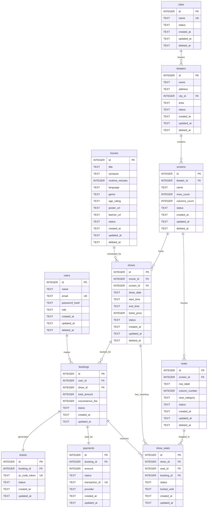

# Database Design Specification
## Movie Ticketing Platform (BookMyShow Clone)

| Document | Database Design Specification |
|---|---|
| **Version** | 1.0 |
| **Status** | Approved |
| **Author** | Senior Solution Architect |
| **Audience** | Product Manager, Backend Team, Database Engineers, QA Team |

---

## 1. Database Information

* **Database Engine**: SQLite 3 (Write-Ahead Logging enabled for development and MVP validation).
* **Target Migration Engine**: PostgreSQL (Enterprise production deployment).
* **Character Set**: UTF-8 (default for SQLite/Postgres text columns).
* **Collation**: BINARY (case-sensitive string comparison, except where explicitly case-insensitive, e.g. emails using NOCASE).
* **Naming Convention**: `snake_case` for all table names, column names, constraints, and index names (e.g., `user_id`, `show_seats`, `idx_users_email`).

---

## 2. Entity List

| Entity | Description | Relationships | Owner / Context |
|---|---|---|---|
| **User** | Represents platform accounts (Customers, Administrators). | Has many Bookings | Authentication / Access Control |
| **City** | Represents geographical listing nodes. | Has many Theaters | City Management / Filtering |
| **Movie** | Represents films playing on the platform. | Has many Shows | Movie Discovery |
| **Theater** | Represents physical theater buildings. | Belongs to City, Has many Screens | Inventory / Venue |
| **Screen** | Represents theater halls/screens. | Belongs to Theater, Has many Seats, Has many Shows | Inventory / Venue |
| **Seat** | Represents physical seats in a screen layout. | Belongs to Screen, Has many ShowSeats | Inventory / Venue |
| **Show** | Represents an instance of a Movie screened in a Screen at a specific time. | Belongs to Movie, Belongs to Screen, Has many ShowSeats, Has many Bookings | Scheduling |
| **ShowSeat** | Represents the availability inventory of a specific Seat for a specific Show. | Belongs to Show, Belongs to Seat, Belongs to Booking (nullable) | Transaction / Locking |
| **Booking** | Represents a user ticket booking transaction. | Belongs to User, Belongs to Show, Has many ShowSeats, Has one Payment, Has one Ticket | Transaction / Locking |
| **Payment** | Represents transaction receipts. | Belongs to Booking | Checkout / Payment |
| **Ticket** | Represents confirmed booking entry passes. | Belongs to Booking | Post-Purchase / Entry |

---

## 3. Entity Relationship Diagram

The following Mermaid diagram maps the database entities, attributes, primary/foreign keys, and relationships:

---

## 4. Table Definitions & Column Definitions

### Table 1: `users`
Represents customer and admin accounts.
* **Columns**:
  * `id`: `INTEGER` | Primary Key | Autoincrement
  * `name`: `TEXT` | Not Null | E.g., 'John Doe'
  * `email`: `TEXT` | Not Null | Unique | Collation: NOCASE
  * `password_hash`: `TEXT` | Not Null | Bcrypt password hash
  * `role`: `TEXT` | Not Null | Default: `'customer'` | E.g., `'customer'`, `'admin'`
  * `created_at`: `TEXT` | Not Null | ISO 8601 UTC timestamp
  * `updated_at`: `TEXT` | Not Null | ISO 8601 UTC timestamp
  * `deleted_at`: `TEXT` | Nullable | ISO 8601 UTC timestamp

### Table 2: `cities`
Represents locations supported by the platform.
* **Columns**:
  * `id`: `INTEGER` | Primary Key | Autoincrement
  * `name`: `TEXT` | Not Null | Unique | E.g., 'Bengaluru', 'Mumbai'
  * `status`: `TEXT` | Not Null | Default: `'active'` | E.g., `'active'`, `'inactive'`
  * `created_at`: `TEXT` | Not Null | ISO 8601 UTC timestamp
  * `updated_at`: `TEXT` | Not Null | ISO 8601 UTC timestamp
  * `deleted_at`: `TEXT` | Nullable | ISO 8601 UTC timestamp

### Table 3: `movies`
Represents the global movie database.
* **Columns**:
  * `id`: `INTEGER` | Primary Key | Autoincrement
  * `title`: `TEXT` | Not Null
  * `synopsis`: `TEXT` | Not Null
  * `runtime_minutes`: `INTEGER` | Not Null | E.g., 148
  * `language`: `TEXT` | Not Null | E.g., 'English', 'Hindi'
  * `genre`: `TEXT` | Not Null | E.g., 'Action', 'Sci-Fi'
  * `age_rating`: `TEXT` | Not Null | E.g., 'U/A', 'A', 'U', 'PG-13'
  * `poster_url`: `TEXT` | Not Null | URL link to thumbnail poster
  * `banner_url`: `TEXT` | Not Null | URL link to detailed marquee banner
  * `status`: `TEXT` | Not Null | Default: `'published'` | E.g., `'draft'`, `'published'`, `'archived'`
  * `created_at`: `TEXT` | Not Null | ISO 8601 UTC timestamp
  * `updated_at`: `TEXT` | Not Null | ISO 8601 UTC timestamp
  * `deleted_at`: `TEXT` | Nullable | ISO 8601 UTC timestamp

### Table 4: `theaters`
Represents cinemas located in specific cities.
* **Columns**:
  * `id`: `INTEGER` | Primary Key | Autoincrement
  * `name`: `TEXT` | Not Null | E.g., 'PVR Multiplex'
  * `address`: `TEXT` | Not Null
  * `city_id`: `INTEGER` | Not Null | Foreign Key referencing `cities(id)`
  * `area`: `TEXT` | Not Null | E.g., 'Indiranagar'
  * `status`: `TEXT` | Not Null | Default: `'active'` | E.g., `'active'`, `'inactive'`
  * `created_at`: `TEXT` | Not Null | ISO 8601 UTC timestamp
  * `updated_at`: `TEXT` | Not Null | ISO 8601 UTC timestamp
  * `deleted_at`: `TEXT` | Nullable | ISO 8601 UTC timestamp

### Table 5: `screens`
Represents theater screening halls.
* **Columns**:
  * `id`: `INTEGER` | Primary Key | Autoincrement
  * `theater_id`: `INTEGER` | Not Null | Foreign Key referencing `theaters(id)`
  * `name`: `TEXT` | Not Null | E.g., 'Screen 1', 'IMAX 3D'
  * `rows_count`: `INTEGER` | Not Null | Number of seat rows in the screen
  * `columns_count`: `INTEGER` | Not Null | Number of columns in each row
  * `status`: `TEXT` | Not Null | Default: `'active'` | E.g., `'active'`, `'inactive'`
  * `created_at`: `TEXT` | Not Null | ISO 8601 UTC timestamp
  * `updated_at`: `TEXT` | Not Null | ISO 8601 UTC timestamp
  * `deleted_at`: `TEXT` | Nullable | ISO 8601 UTC timestamp

### Table 6: `seats`
Represents the structural physical seats inside screens.
* **Columns**:
  * `id`: `INTEGER` | Primary Key | Autoincrement
  * `screen_id`: `INTEGER` | Not Null | Foreign Key referencing `screens(id)`
  * `row_label`: `TEXT` | Not Null | E.g., 'A', 'B', 'C'
  * `column_number`: `INTEGER` | Not Null | E.g., 1, 2, 3...
  * `seat_category`: `TEXT` | Not Null | Default: `'classic'` | E.g., `'classic'`, `'premium'`, `'recliner'`
  * `status`: `TEXT` | Not Null | Default: `'active'` | E.g., `'active'`, `'inactive'`
  * `created_at`: `TEXT` | Not Null | ISO 8601 UTC timestamp
  * `updated_at`: `TEXT` | Not Null | ISO 8601 UTC timestamp
  * `deleted_at`: `TEXT` | Nullable | ISO 8601 UTC timestamp

### Table 7: `shows`
Represents specific scheduled screenings of movies on screens.
* **Columns**:
  * `id`: `INTEGER` | Primary Key | Autoincrement
  * `movie_id`: `INTEGER` | Not Null | Foreign Key referencing `movies(id)`
  * `screen_id`: `INTEGER` | Not Null | Foreign Key referencing `screens(id)`
  * `show_date`: `TEXT` | Not Null | ISO 8601 date string, format: `'YYYY-MM-DD'`
  * `start_time`: `TEXT` | Not Null | ISO 8601 timestamp, format: `'YYYY-MM-DD HH:MM:SS'`
  * `end_time`: `TEXT` | Not Null | ISO 8601 timestamp, format: `'YYYY-MM-DD HH:MM:SS'`
  * `ticket_price`: `INTEGER` | Not Null | Stored in cents (e.g. 1500 for $15.00)
  * `status`: `TEXT` | Not Null | Default: `'scheduled'` | E.g., `'scheduled'`, `'active'`, `'completed'`, `'cancelled'`
  * `created_at`: `TEXT` | Not Null | ISO 8601 UTC timestamp
  * `updated_at`: `TEXT` | Not Null | ISO 8601 UTC timestamp
  * `deleted_at`: `TEXT` | Nullable | ISO 8601 UTC timestamp

### Table 8: `show_seats`
Represents the transactional state inventory of a seat for a scheduled show. This is populated automatically when a show is scheduled.
* **Columns**:
  * `id`: `INTEGER` | Primary Key | Autoincrement
  * `show_id`: `INTEGER` | Not Null | Foreign Key referencing `shows(id)`
  * `seat_id`: `INTEGER` | Not Null | Foreign Key referencing `seats(id)`
  * `booking_id`: `INTEGER` | Nullable | Foreign Key referencing `bookings(id)`
  * `status`: `TEXT` | Not Null | Default: `'available'` | E.g., `'available'`, `'locked'`, `'booked'`
  * `locked_until`: `TEXT` | Nullable | ISO 8601 timestamp, expiration time of temporary seat lock
  * `created_at`: `TEXT` | Not Null | ISO 8601 UTC timestamp
  * `updated_at`: `TEXT` | Not Null | ISO 8601 UTC timestamp

### Table 9: `bookings`
Represents purchase transactions made by users.
* **Columns**:
  * `id`: `INTEGER` | Primary Key | Autoincrement
  * `user_id`: `INTEGER` | Not Null | Foreign Key referencing `users(id)`
  * `show_id`: `INTEGER` | Not Null | Foreign Key referencing `shows(id)`
  * `total_amount`: `INTEGER` | Not Null | Total price in cents (subtotal + convenience fee)
  * `convenience_fee`: `INTEGER` | Not Null | Fee stored in cents
  * `status`: `TEXT` | Not Null | Default: `'initiated'` | E.g., `'initiated'`, `'seats_locked'`, `'payment_pending'`, `'confirmed'`, `'failed'`, `'cancelled'`
  * `created_at`: `TEXT` | Not Null | ISO 8601 UTC timestamp
  * `updated_at`: `TEXT` | Not Null | ISO 8601 UTC timestamp

### Table 10: `payments`
Represents financial transactional logs.
* **Columns**:
  * `id`: `INTEGER` | Primary Key | Autoincrement
  * `booking_id`: `INTEGER` | Not Null | Foreign Key referencing `bookings(id)`
  * `amount`: `INTEGER` | Not Null | Amount in cents
  * `status`: `TEXT` | Not Null | Default: `'pending'` | E.g., `'pending'`, `'success'`, `'failed'`
  * `transaction_id`: `TEXT` | Nullable | Unique transaction ID from payment system
  * `provider`: `TEXT` | Not Null | Default: `'simulator'` | E.g., `'simulator'`, `'stripe'`, `'razorpay'`
  * `created_at`: `TEXT` | Not Null | ISO 8601 UTC timestamp
  * `updated_at`: `TEXT` | Not Null | ISO 8601 UTC timestamp

### Table 11: `tickets`
Represents generated entry passes.
* **Columns**:
  * `id`: `INTEGER` | Primary Key | Autoincrement
  * `booking_id`: `INTEGER` | Not Null | Foreign Key referencing `bookings(id)`
  * `qr_code_token`: `TEXT` | Not Null | Unique | Cryptographic token representing booking validation hash
  * `status`: `TEXT` | Not Null | Default: `'valid'` | E.g., `'valid'`, `'used'`, `'cancelled'`
  * `created_at`: `TEXT` | Not Null | ISO 8601 UTC timestamp
  * `updated_at`: `TEXT` | Not Null | ISO 8601 UTC timestamp

---

## 5. Data Types

To align with SQLite's dynamic, minimalist type system and ensure clean migration paths to relational enterprise engines like PostgreSQL, tables use a strict subset of mapping behaviors:

1. **INTEGER**: Used for auto-increment keys, counts (`rows_count`, `columns_count`), numerical status limits, and currency.
2. **TEXT**: Used for user profile strings, hashes, roles, status enumerations, and links.
   * *NOCASE Collation*: Enforced on email columns (`users.email`) to ensure case-insensitive unique constraints natively within database query evaluations.
3. **REAL**: Excluded from financial logic.
   * *Monetary Design*: Floating-point formats introduce rounding inaccuracies (e.g. `$10.10 + $10.20` could evaluate to `20.300000000004` under binary floating points). Money attributes (`ticket_price`, `total_amount`, `convenience_fee`, `payments.amount`) are stored strictly as **integers in cents** (e.g., $15.50 = `1550`).
4. **Dates and Times**: Stored as `TEXT` using **ISO 8601 UTC Format** (`'YYYY-MM-DD HH:MM:SS'`). This enables lexicographical sorting and allows SQLite date/time functions (like `datetime()`, `strftime()`) to work correctly out of the box.

---

## 6. Constraints

### NOT NULL Constraints
Applied to all columns except nullable audit/state indicators to guarantee schema reliability. Permitted null fields are restricted to:
- `users.deleted_at`, `cities.deleted_at`, `movies.deleted_at`, `theaters.deleted_at`, `screens.deleted_at`, `seats.deleted_at`, `shows.deleted_at` (soft deletion flags).
- `show_seats.booking_id`, `show_seats.locked_until` (unlocked seats contain null locks).
- `payments.transaction_id` (pre-auth pending transactions have no processing ID).

### CHECK Constraints
Check constraints validate business rules natively at the database engine tier:
* **`users.role`**: `role IN ('customer', 'admin')`
* **`users.email`**: `email LIKE '%_@_%._%'` (Basic email format syntax validation)
* **`cities.status`**: `status IN ('active', 'inactive')`
* **`movies.runtime_minutes`**: `runtime_minutes > 0`
* **`movies.status`**: `status IN ('draft', 'published', 'archived')`
* **`theaters.status`**: `status IN ('active', 'inactive')`
* **`screens.rows_count`**: `rows_count > 0 AND rows_count <= 26` (restricts labels to letters A-Z)
* **`screens.columns_count`**: `columns_count > 0 AND columns_count <= 50`
* **`screens.status`**: `status IN ('active', 'inactive')`
* **`seats.status`**: `status IN ('active', 'inactive')`
* **`seats.column_number`**: `column_number > 0`
* **`shows.ticket_price`**: `ticket_price >= 0`
* **`shows.status`**: `status IN ('scheduled', 'active', 'completed', 'cancelled')`
* **`shows.end_time`**: `end_time > start_time`
* **`show_seats.status`**: `status IN ('available', 'locked', 'booked')`
* **`bookings.total_amount`**: `total_amount >= 0`
* **`bookings.convenience_fee`**: `convenience_fee >= 0`
* **`bookings.status`**: `status IN ('initiated', 'seats_locked', 'payment_pending', 'confirmed', 'failed', 'cancelled')`
* **`payments.amount`**: `amount > 0`
* **`payments.status`**: `status IN ('pending', 'success', 'failed')`
* **`tickets.status`**: `status IN ('valid', 'used', 'cancelled')`

### UNIQUE Constraints
* `users(email)`
* `cities(name)`
* `seats(screen_id, row_label, column_number)`: Prevents overlapping physical layout placements.
* `show_seats(show_id, seat_id)`: Prevents duplicate seat assignment states inside the same show catalog.
* `payments(transaction_id)` (Non-null unique indices).
* `tickets(qr_code_token)`

---

## 7. Primary Keys

* **Engine Level**: SQLite assigns 64-bit signed integers to auto-incrementing primary keys. This ensures fast row lookups and guarantees record order by default.
* **POSTGRESQL Migration Road**: While integers are optimal for SQLite MVP, scaling horizontally across database instances introduces index collision risks. The database design maps easily to **UUIDv4** keys (backed by PostgreSQL UUID columns) when migrating, avoiding primary key collisions.

---

## 8. Foreign Keys

Cascade delete operations must be controlled to prevent accidental data loss and maintain booking logs:

| Source Table | Source Column | Target Table | Target Column | On Update | On Delete | Reason |
|---|---|---|---|---|---|---|
| `theaters` | `city_id` | `cities` | `id` | CASCADE | RESTRICT | Prevent deleting a city if theaters exist. |
| `screens` | `theater_id` | `theaters` | `id` | CASCADE | RESTRICT | Prevent deleting active theaters with configured screens. |
| `seats` | `screen_id` | `screens` | `id` | CASCADE | CASCADE | Deleting a screen cleans up its physical seat layout automatically. |
| `shows` | `movie_id` | `movies` | `id` | CASCADE | RESTRICT | Prevent removing movies that have scheduled showtimes. |
| `shows` | `screen_id` | `screens` | `id` | CASCADE | RESTRICT | Prevent removing screens that have scheduled showtimes. |
| `show_seats` | `show_id` | `shows` | `id` | CASCADE | CASCADE | Deleting a showtime automatically purges its show seat inventory. |
| `show_seats` | `seat_id` | `seats` | `id` | CASCADE | RESTRICT | Prevent deleting physical seat definitions if show references exist. |
| `show_seats` | `booking_id` | `bookings` | `id` | CASCADE | SET NULL | If a booking record is cleared/reset, release the show seat reservation. |
| `bookings` | `user_id` | `users` | `id` | CASCADE | RESTRICT | Prevent deleting user accounts that have transaction histories. |
| `bookings` | `show_id` | `shows` | `id` | CASCADE | RESTRICT | Prevent removing shows with associated bookings. |
| `payments` | `booking_id` | `bookings` | `id` | CASCADE | RESTRICT | Preserve payment receipts. |
| `tickets` | `booking_id` | `bookings` | `id` | CASCADE | RESTRICT | Prevent deleting bookings that generated ticket credentials. |

---

## 9. Index Strategy

Indexes optimize lookup speeds for discovery filters and transaction concurrency bottlenecks.

### Primary Index
* Enforced automatically on all integer primary keys (`id` columns).

### Unique Index
* `idx_users_email_uq` on `users(email)`
* `idx_cities_name_uq` on `cities(name)`
* `idx_seats_layout_uq` on `seats(screen_id, row_label, column_number)`
* `idx_show_seats_uq` on `show_seats(show_id, seat_id)`
* `idx_tickets_qr_uq` on `tickets(qr_code_token)`

### Search / Filter Indexes (Composite & Single)
* **`idx_movies_status_title`** on `movies(status, title)`
  * *Use Case*: Speeds up active movie list querying and title lookups on the homepage.
* **`idx_theaters_city_status`** on `theaters(city_id, status)`
  * *Use Case*: Speeds up listing location-based active theaters.
* **`idx_shows_screen_time`** on `shows(screen_id, show_date, start_time)`
  * *Use Case*: Essential for identifying show collisions during admin scheduling and querying theater shows.
* **`idx_shows_movie_date`** on `shows(movie_id, show_date)`
  * *Use Case*: Optimizes customer queries checking dates/theaters for a specific movie.
* **`idx_bookings_user_show`** on `bookings(user_id, show_id)`
  * *Use Case*: Speeds up "My Bookings" lookup times and user transaction verification.

---

## 10. Normalization Analysis

### First Normal Form (1NF)
All attributes are atomic, and there are no repeating groups or multi-valued columns.
- *Example*: Multiple seats selected in a booking are not stored as a comma-separated list of strings in the `bookings` table. Instead, they are represented as distinct rows in the `show_seats` table referencing the `booking_id`.

### Second Normal Form (2NF)
The schema satisfies 1NF, and all non-prime attributes are fully functionally dependent on the primary key (no partial dependencies on composite candidate keys).
- *Example*: In `show_seats`, the attributes `status` and `locked_until` depend entirely on the primary key `id`. If the key were composite (e.g., `show_id` and `seat_id`), all attributes would still depend on the entire key composite. By using a surrogate auto-increment key, we ensure single-column functional dependency.

### Third Normal Form (3NF)
The schema satisfies 2NF, and no non-prime attributes have transitive functional dependencies on the primary key (non-prime attributes do not determine other non-prime attributes).
- *Example*: The `theaters` table contains `city_id` pointing to the `cities` table. It does not store `city_name` directly. Storing `city_name` in `theaters` would create a transitive dependency: `theater_id -> city_id -> city_name`. Moving city details to `cities` eliminates this redundancy.

---

## 11. Audit Columns & Soft Delete Strategy

### Audit Columns
To track modifications, all primary operational tables (excluding transaction-critical transient tables like `show_seats` to minimize write overhead) include:
* `created_at`: Text, default current timestamp.
* `updated_at`: Text, default current timestamp (updated via backend hooks or database triggers).
* `created_by` / `updated_by` (optional for Postgres, represents the user/admin ID executing the modification, mapped to foreign keys referencing `users(id)`).

### Soft Delete Strategy
To protect historical records and financial analytics from data corruption, physical deletion (`DELETE` statements) is prohibited for inventory and metadata entities (`users`, `cities`, `movies`, `theaters`, `screens`, `seats`, `shows`).
* **Column**: `deleted_at` (TEXT, Nullable, default NULL).
* **Execution**: Deletion updates the record's `deleted_at` field with the current UTC timestamp (e.g., `UPDATE movies SET deleted_at = datetime('now') WHERE id = 5`).
* **Query Filter**: Client and API queries must append `deleted_at IS NULL` to filter operations.
* **Data Integrity**: Historical bookings reference the archived record, preventing lookup crashes for previous customer tickets.

---

## 12. Migration Strategy

The backend query builder, Knex.js, coordinates schema setups chronologically:

### Initial Schema (Migration v1)
Creates the core layout tables (`users`, `cities`, `movies`, `theaters`, `screens`, `seats`).

### Transaction Setup (Migration v2)
Adds scheduling, transaction, and ticketing tables (`shows`, `show_seats`, `bookings`, `payments`, `tickets`) with appropriate foreign keys.

### Rollback Strategy
Each migration file implements a symmetrical `down()` method that safely executes `DROP TABLE IF EXISTS` in reverse order of creation. This ensures developers can clean their environment using `knex migrate:rollback` without database corruption.

---

## 13. Future Scalability

As traffic scales and we migrate to PostgreSQL, the database design supports the following scalability strategies:

1. **Partitioning**: Partition `show_seats` and `bookings` tables by show dates (`shows.show_date`), isolating concurrent booking writes to current show dates and speeding up index scans for active sales.
2. **Read Replicas**: Distribute database read traffic by routing movie discovery, theater details, and historical bookings to read replicas. The primary write node is reserved for seat locking, payments, and ticket confirmations.
3. **Database Sharding**: Sharding by geographic location (`city_id`) is highly effective, since movie bookings, theater operations, and show lists are location-specific.
4. **Caching Integration**: Integrate Redis to handle hot-read queries (e.g., active cities, movie lists, theater show schedules) and manage transient seat locks using Redis TTL (Time-To-Live) keys, reducing write overhead on the primary database.
