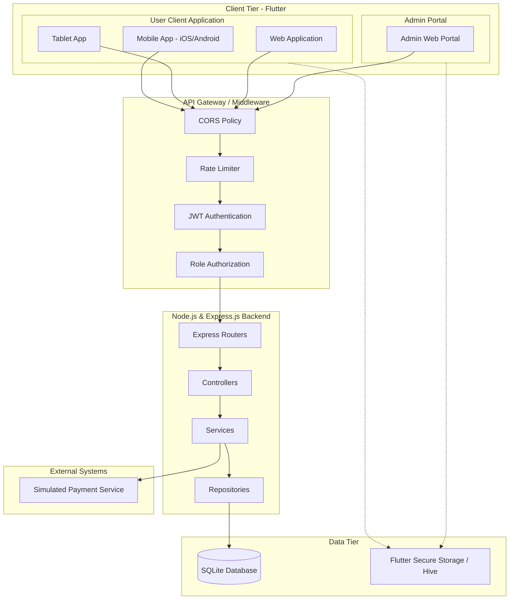
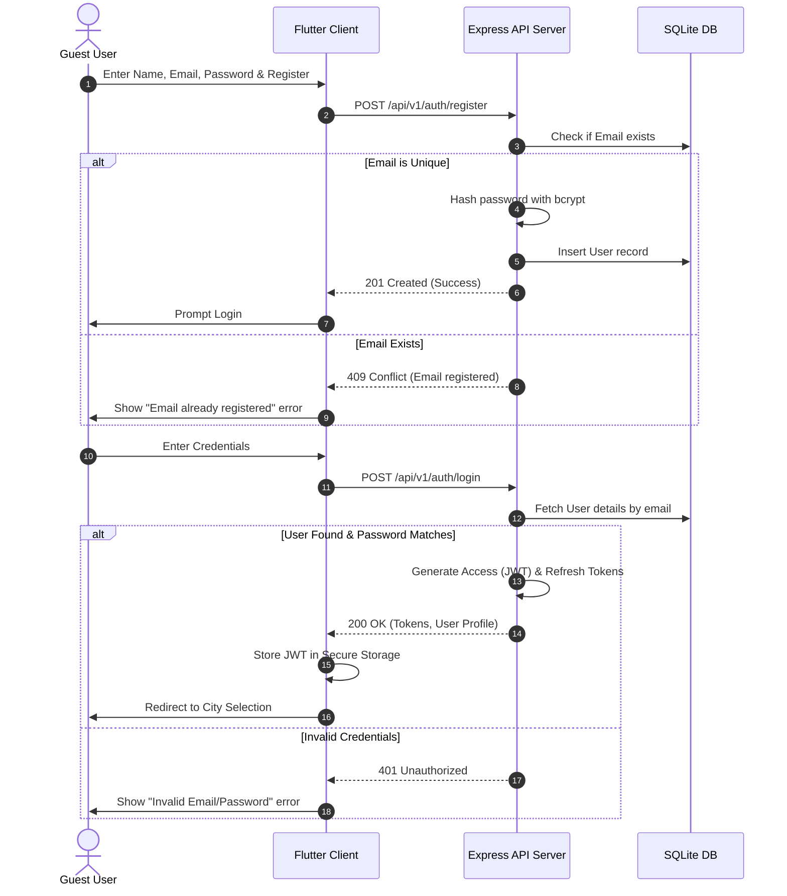
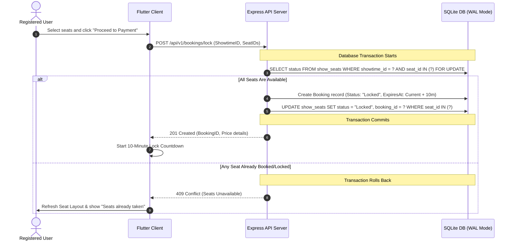
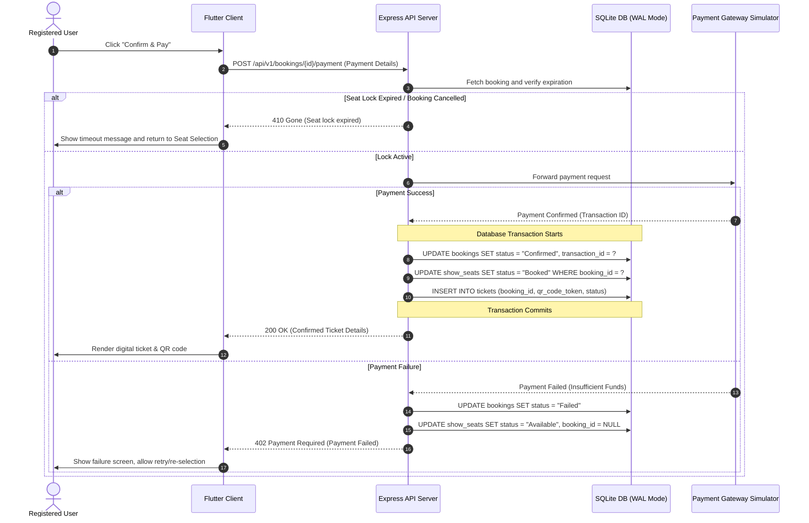

# System Design Document
## Movie Ticketing Platform (BookMyShow Clone)

| Document | System Design Specification |
|---|---|
| **Version** | 1.0 |
| **Status** | Approved |
| **Author** | Senior Solution Architect |
| **Audience** | Product Manager, Frontend Team, Backend Team, QA Team |

---

## 1. Executive Summary

The Movie Ticketing Platform is an enterprise-grade, location-aware web and mobile application designed to replicate the end-to-end ticketing flows of modern platforms like BookMyShow or Fandango. The system provides a centralized destination for movie discovery, real-time seat locking, checkout, simulated payment processing, and digital ticket issuance.

### Core User Roles
* **Guest User**: Unauthenticated visitors who can browse cities, discover movies, view movie details, check theaters, and inspect showtimes.
* **Registered User (Customer)**: Authenticated users who can perform seat selection, complete simulated bookings, view digital tickets, and access a detailed booking history.
* **System Administrator**: Privileged operators who manage movies, theaters, screens, and show schedules, and view system occupancy/revenue reports.

---

## 2. Architecture Overview

The system uses a classic **Three-Tier Architecture** pattern to isolate concerns and ensure independent scaling and maintenance across layers:

```
[ Client Tier ]        --> Flutter (Responsive User Web/Mobile/Tablet + Admin Web Portal)
       │
       ▼
[ Application Tier ]   --> Node.js / Express.js REST API
       │
       ▼
[ Data Tier ]          --> SQLite Database (with transactional WAL mode for MVP)
```

1. **Client Tier**: Cross-platform client applications built using Flutter, sharing a unified codebase for user-facing applications across Web, Mobile, and Tablet form-factors, alongside a dedicated Flutter Web application for administration.
2. **Application Tier**: A stateless Express.js server hosted on Node.js. It exposes standard REST endpoints, enforces authentication and Role-Based Access Control (RBAC), applies validation rules, coordinates transactional seat-locking logic, and integrates with external services.
3. **Data Tier**: SQLite database utilizing Write-Ahead Logging (WAL) mode to support concurrency during development and MVP validation, with a detailed roadmap to migrate to PostgreSQL/MySQL for high-concurrency production deployments.

---

## 3. Technology Stack

### Frontend Client
* **Framework**: **Flutter (Dart)**
  * *Rationale*: Offers high-performance native-quality rendering from a single codebase. Facilitates responsive layouts across Mobile (iOS/Android), Tablet, and Web for the customer application, and builds a performant, modular Web application for the Admin dashboard.
* **State Management**: **Riverpod**
  * *Rationale*: Provides compile-safe, testable state management with declarative dependency injection, caching, and state disposal out of the box.
* **Navigation**: **GoRouter**
  * *Rationale*: Enforces declarative, URL-based routing necessary for deep linking and screen synchronization across Flutter Web, Mobile, and Tablet.
* **HTTP Client**: **Dio**
  * *Rationale*: Advanced HTTP client supporting interceptors (for JWT authorization attach/retry), global configurations, form-data, and request cancellation.
* **Local Caching**: **Flutter Secure Storage** (for sensitive JWTs) and **Hive** or **Isar** (for offline metadata and city caching).

### Backend API
* **Runtime**: **Node.js (LTS)**
  * *Rationale*: Asynchronous, event-driven, non-blocking I/O model suited for high-concurrency I/O-bound requests (e.g., browsing movies, seat status polling).
* **Framework**: **Express.js**
  * *Rationale*: Minimalist, lightweight, and unopinionated routing framework that enables modular middleware chains (auth, CORS, rate limits).
* **Database Driver / Query Builder**: **Knex.js**
  * *Rationale*: SQL query builder that simplifies schema migration, connection pooling, and provides clean support for raw SQL transitions.

### Database
* **Database Engine**: **SQLite** (for MVP)
  * *Rationale*: Low-overhead, zero-configuration database that matches the requirements for the local development sandbox. Enable **Write-Ahead Logging (WAL)** mode to support simultaneous reads and single-writer concurrency.
* **Enterprise Production Recommendations**: **PostgreSQL** or **MySQL** (for production sharding, read replicas, and robust row-level transactions under high booking volume), paired with **Redis** (for distributed locking and transient seat lock storage).

---

## 4. Frontend Architecture

The frontend client structure aligns with Clean Architecture principles, splitting the project into three core layers:

```
[ Presentation Layer (UI & Controllers) ] 
       │
       ▼
[ Domain Layer (Entities & Use Cases) ]
       │
       ▼
[ Data Layer (Repositories & Data Sources) ]
```

### Key Subsystems
1. **Responsive Layout Engine**: Employs Flutter's `LayoutBuilder` and `MediaQuery` to dynamically adapt UI components from narrow phone screens to wide desktop browsers.
   * *Mobile/Tablet App*: Features bottom navigation sheets, native gestures, and interactive canvas pinch-and-zoom for seat map selection.
   * *Web Portal*: Displays detailed grids, larger marquee banners, and side-by-side split screens.
   * *Admin Portal*: Tailored specifically for desktop web displays with data tables, search/filter controls, and sidebars.
2. **State & Cache Sync**: Riverpod providers handle local reactive cache invalidation. When a user changes their active city, the application invalidates the movie details, theater lists, and schedules, forcing a lazy fetch of location-specific data.
3. **Route Guarding**: GoRouter redirects unauthenticated users to the Login/Register flow when accessing protected actions (like seat booking or booking history).

---

## 5. Backend Architecture

The backend implements a **Layered Architecture** pattern to guarantee clear separation of concerns, maintainability, and testability.

```
Request ──> [Middleware Chain] ──> [Router] ──> [Controller] ──> [Service] ──> [Repository] ──> DB
```

1. **Middleware Chain**: Handles cross-cutting concerns (CORS, Rate Limiting, Input Validation, Token Decoding, and RBAC authorization).
2. **Controller Layer**: Parses HTTP request parameters (headers, body, path, query parameters), maps requests to appropriate service functions, and translates return values or exceptions into standardized HTTP responses.
3. **Service (Domain) Layer**: Contains core business logic (e.g., ticket price calculation, convenience fee application, seat lock timeout checks, transaction orchestrations). The Service layer remains independent of Express.js routing.
4. **Repository Layer**: Acts as an abstraction over SQLite database queries, encapsulating database-specific dialect and SQL syntax.
5. **Dependency Injection**: Services and repositories are injected via constructors to facilitate mocking and unit testing.

---

## 6. Authentication & Authorization

The platform enforces stateless session management using JSON Web Tokens (JWT).

### JWT Strategy
* **Access Token**: Short-lived (e.g., 15 minutes) bearer token, transmitted via the `Authorization: Bearer <token>` header, used to authenticate request ownership.
* **Refresh Token**: Long-lived (e.g., 7 days) token stored securely (in HttpOnly cookies for Web clients, and Flutter Secure Storage for Mobile). It is sent to a dedicated `/api/v1/auth/refresh` endpoint to generate a new Access Token without requiring manual credentials.

### Role-Based Access Control (RBAC)
Every authenticated request is mapped to one of three roles, with specific API path permissions:

| Role | Allowed API Endpoints | Restrictions |
|---|---|---|
| **Guest** | `/api/v1/movies/*` (GET), `/api/v1/cities` (GET), `/api/v1/auth/register` (POST), `/api/v1/auth/login` (POST) | Rejects booking requests, history access, and administration paths. |
| **Registered User** | Guest permissions + `/api/v1/bookings/*` (GET/POST), `/api/v1/users/profile` (GET) | Prevented from accessing administrative CRUD paths. |
| **Administrator** | `/api/v1/admin/*` (GET/POST/PUT/DELETE) | Prevented from interacting with user booking flows or editing completed ticket records. |

---

## 7. Security Strategy

* **Password Hashing**: Direct plain-text password storage is prohibited. All user passwords are encrypted using **bcrypt** with a work factor of 12 (or **argon2id**) prior to database persistence.
* **SQL Injection Protection**: The application prevents SQL injection by utilizing Knex.js parameterized query structures for all database read and write actions. Raw queries, if required, are strictly formatted using positional placeholders.
* **Cross-Origin Resource Sharing (CORS)**: Restricts backend API accessibility exclusively to approved client domains (e.g., the Flutter Web application hostname).
* **XSS & CSRF Protection**:
  * Express APIs return appropriate security headers using `helmet`.
  * For Web clients, standard JWTs are recommended to be stored inside short-lived JS memory, while Refresh Tokens utilize `HttpOnly`, `Secure`, and `SameSite=Strict` cookies to block CSRF exploits.
* **Rate Limiting**: Implements IP-based rate limiting via middleware (e.g., `express-rate-limit`) to prevent brute-force attacks on endpoints like `/login` or `/register` (e.g., maximum 100 requests per 15 minutes per IP).
* **API Validation**: Strong schema-based validation on all requests using libraries like **Zod** or **Joi** to intercept malformed request parameters before they reach the services layer.

---

## 8. High-Level Component Diagram

This diagram visualizes the communication paths between the user/admin client views, the middleware controllers, core backend services, and the data layers:



---

## 9. Data Flow Diagrams

### User Registration & Login Flow



### Seat Locking Flow (Concurrency Management)



### Checkout & Simulated Payment Flow



---

## 10. Deployment Overview

* **Containerization**: Use Docker to containerize both the backend application and the Flutter Web builds, ensuring environment parity across staging and production.
* **Environment Variables**: Configure all secrets (JWT secrets, API ports, CORS domains, simulated gateway URLs) via a `.env` file, loaded at startup.
* **SQLite Data Persistence**: The SQLite database file is mounted as a Docker Volume (`-v /var/data/movie-ticketing:/app/database`) to prevent data loss when containers restart.
* **Load Balancer / Reverse Proxy**: Nginx handles incoming HTTP/HTTPS traffic, manages SSL termination, serves compiled static Flutter Web files, and forwards API calls to the Node.js container.

---

## 11. Error Handling Strategy

The system enforces a **Standardized REST Error Interface**. The Express server employs a centralized error-handling middleware that intercepts all thrown errors and returns consistent payload formats:

### Standardized JSON Error Payload
```json
{
  "status": "error",
  "code": "ERROR_CODE",
  "message": "A human-readable explanation of the error.",
  "errors": []
}
```

### Response HTTP Status Mapping
* `400 Bad Request`: Input validation failures (e.g., invalid email structure, missing seat IDs). The `errors` array will include individual field error logs.
* `401 Unauthorized`: Missing, expired, or corrupted JWT.
* `403 Forbidden`: Authenticated user attempting to perform unauthorized roles (e.g., Customer requesting admin movie creation).
* `404 Not Found`: Entity not found (e.g., query for a movie or show ID that does not exist).
* `409 Conflict`: Concurrency and state violations (e.g., email already exists, seat is already booked/locked).
* `410 Gone`: Seat lock expired before payment submission.
* `500 Internal Server Error`: Unhandled database failures or runtime errors.

---

## 12. Logging Strategy

A unified logging framework prevents silent failures and helps diagnose concurrency errors:

* **Engine**: Winston logging library coupled with Morgan middleware for request-level HTTP telemetry.
* **Log Levels**:
  * `info`: High-level operations (e.g., successful user logins, booking creations, ticket generations).
  * `warn`: Warning flags (e.g., invalid authentication attempts, expired seat locks released, validation failures).
  * `error`: Structural bugs or system issues (e.g., database disconnects, unhandled exceptions, simulated payment failures).
* **Segregation & Rotation**: Logs are outputted to both the terminal console (during development) and persistent rotated log files (using `winston-daily-rotate-file` in production) to split logs into `combined.log` and `error.log`.
* **Query Logs**: Enable SQL statement logging (via Knex settings) at the debug level in non-production environments to audit transactions and index efficiency.

---

## 13. Scalability Strategy

While SQLite is performant for MVP scale, high-traffic production ticketing (with high write concurrency during ticket sales) demands a scalable architecture.

### Database Migration Path
```
[ SQLite (WAL) ] ──> [ PostgreSQL / MySQL ] ──> [ Read Replicas & Connection Poolers ]
```

1. **PostgreSQL Transition**: Move to PostgreSQL to leverage true row-level locking (`SELECT ... FOR UPDATE`), transaction isolation tiers, and handle thousands of concurrent queries without lock starvation.
2. **Read-Write Splitting**: Route read operations (movies list, cities, showtimes) to PostgreSQL read replicas, directing writes (seat booking, payments) to the primary database writer node.
3. **Connection Pooling**: Implement PgBouncer to efficiently manage open connections across high-concurrency requests.

### Redis Caching & Distributed Locks
* **Session Cache**: Store user sessions and active JWT blacklists in Redis for sub-millisecond retrieval.
* **Transient Seat Locking**: Rather than querying the main relational database constantly to check temporary 10-minute locks, store active seat locks in Redis with automated Time-To-Live (TTL) expiration matching the lock duration.
* **Database Indexes**: Index fields that support search/filter options (`movies.title`, `movies.city_id`), show schedules (`shows.date`, `shows.showtime_id`), and booking records (`bookings.user_id`, `show_seats.showtime_id`).

---

## 14. Performance Strategy

* **API Latency SLAs**:
  * Authentication APIs: Under **500 ms**.
  * Movie Search & Filter APIs: Under **300 ms**.
  * Booking Completion APIs: Under **1000 ms** (excluding external network simulations).
* **Flutter Optimizations**:
  * **Lazy-Loading**: Utilize GoRouter deferred loading for large web app routes to minimize initial asset bundle sizes.
  * **Repaint Boundaries**: Wrap interactive components (like the seat map layout canvas) in `RepaintBoundary` widgets to restrict screen paint triggers exclusively to modified seat cells.
* **Database Optimization**: Ensure all show listings and seat layouts are returned via unified joins, avoiding nested N+1 database queries.

---

## 15. Folder Structure Recommendations

### Frontend (Flutter Client)
```
frontend/
├── lib/
│   ├── main.dart                  # App bootstrap, Riverpod container initialization
│   ├── app.dart                   # Global MaterialApp configuration & GoRouter routing
│   ├── config/                    # Themes, styles, environment configurations
│   ├── core/                      # Global common structures
│   │   ├── error/                 # Global error models and boundaries
│   │   ├── network/               # Dio HTTP clients, API endpoints list, interceptors
│   │   └── widgets/               # Shared common buttons, inputs, loaders
│   └── features/                  # Feature-based clean architecture folders
│       ├── auth/                  # Login, Register, Profile features
│       ├── movies/                # Discovery marquee, search, filters, details
│       ├── bookings/              # Theater selection, Showtimes, Seat Interactive Map
│       ├── checkout/              # Summary, convenience fees, simulated pay, ticket
│       └── admin/                 # Movie/Theater CRUD interfaces (desktop web only)
│           ├── data/              # Repositories implementations, local/remote data sources
│           ├── domain/            # Entities models, core validation Use Cases
│           └── presentation/      # UI Screens, custom components, Riverpod providers
└── test/                          # Widget, unit, and integration tests
```

### Backend (Node.js & Express)
```
backend/
├── src/
│   ├── server.js                  # App runner and port listener
│   ├── app.js                     # Express app setup, routing mapping, middleware attachment
│   ├── config/                    # Environment variables loader, Winston logger, Knex database configurations
│   ├── constants/                 # Error codes, status strings, business rules values
│   ├── middlewares/               # CORS config, Rate-Limiting, Zod validator, Auth context parsing, RBAC check
│   ├── routes/                    # API v1 route mapping directories (auth, movies, bookings, admin)
│   ├── controllers/               # Express req/res handlers
│   ├── services/                  # Pure Business Logic classes (Auth, SeatLock, Payment, TicketGen)
│   ├── repositories/              # Database SQL interfaces
│   └── database/
│       ├── migrations/            # SQLite schema migration scripts
│       └── seeds/                 # Sample movie catalogs, cities, theaters, and schedules
├── test/
│   ├── unit/                      # Services and models test files
│   └── integration/               # API endpoint tests using Supertest and Jest
├── package.json
└── .env.example
```

---

## 16. Future Extensibility

* **Stripe / Razorpay Integration**: Expose an interface in the checkout service that initializes a Stripe PaymentIntent, replacing the MVP's simulator with webhooks to safely handle payment completions.
* **Food & Beverage Add-ons**: Incorporate a menu-selection screen during the checkout funnel. The backend entity relationships can accommodate booking items.
* **Dynamic Seat Pricing**: Allow admins to define tiered seat costs within screens (e.g., front-row classic vs. premium reclining loungers), dynamically recalculated by the checkout fee logic.
* **Loyalty Points & Rewards**: Support promotional coupon code inputs during checkout with validation checks against user account logs.
* **Real-time Push Notifications**: Integrate services like Firebase Cloud Messaging (FCM) or Twilio to push ticket details, QR codes, and show schedule changes straight to user phones/emails.
